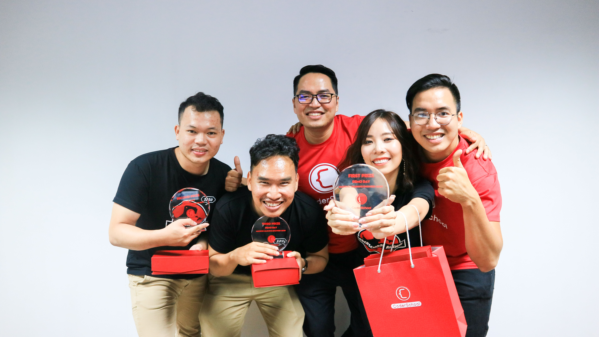

# Overview
a Flask app related to [natural questions answering](https://github.com/xuandinh1907/natural-questions-answering)

There are 2 options :
- answering by reading arbitrary text
- answering by reading wikipedia pages

# App structure

**app/helper.py** 
contains a function to add some special tokens

**app/convert_nq_to_crops_no_link.py**
script to handle with arbitrary text.Model predicts best non-null short answers first.The final one is paragraph including the best

**app/convert_to_crops.py**
script to handle with a wikipedia article.Model also predicts best non-null short answers first.The final one is sentence including the best

**app/models.py**
script to load model

**app/views.py**
main part to set up how data flows

**app/static/assets/custom.js**
java script for controling data from front-end.Note that you need to change the IP to suit with your local IP.For example my local IP is 127.0.0.1:5000 and on VM is 34.80.65.17:5000

**app/templates/pages/qa_link.html**
related closely to app/convert_to_crops.py

**app/templates/pages/qa.html**
related closely to app/convert_to_crops_no_link.py

**app/templates/pages/login.html**
it does not matter but you should create an account in the first time

# Run app
- First you need to download weights.h5 [here](https://drive.google.com/drive/folders/1ykLyUE1feX1S2Ka4YqOxgHjTSByHHHVu?usp=sharing).Then create a new folder nq_bert_uncased_68 and put file into it.
- Secondly,you should create a new env called **google** by command `conda create --name google python=3.7`
- Thirtdly,install all requirements by command `pip install -r requirements.txt`
- Now you can run flask by command `python run.py`

# ML Demo Day 25/02/2019
Fortunately,I won the third prize of Demo Day thanks to this app

